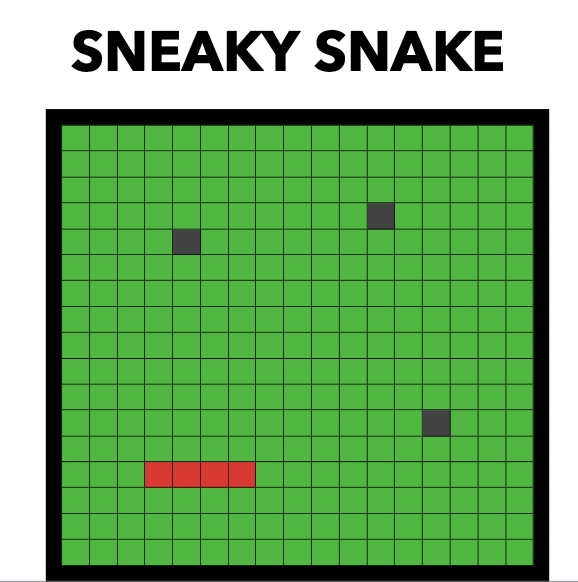

# Project 1 Pitch

## Elevator Pitch
Move through each floor as a snake just looking for a nice meal. Be carful if you eat too much though as every bit of food will make you longer and less sneaky. Try not to eat your own tail by accident!! 
## Tech Stacks
HTML

Javascript

CSS
## Wireframes

## MVP Goals

Render start screen

Render game over screen

Render a 17X17 board 

Move snake with arrow keys

Have collision detection on walls and on self that cause game over

Bits that snake collects increase its size by one each time

## Stretch Goals

Harder stages with more bits

Bits will move independently in room

npc snakes in later stages that can be eaten and eat the the player while also moving independently.

Render stage select screen

adding audio

Render 3 stages of difficulty 

## Potential Roadblocks

Figuring out how the bits will work (Spawning in or having a set amount every stage)

Having the snake grow every time after it eats a bit and keeping the growing body moving together at one

